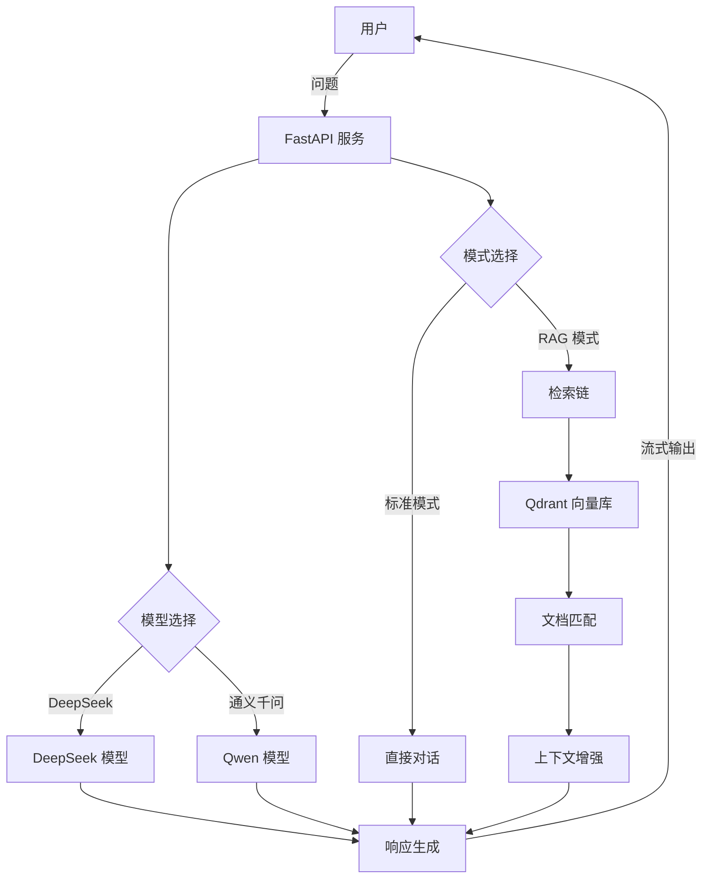

# 🤖 智能客服系统

> 基于 LangChain + RAG + 多模型集成的智能对话平台


---

## 📖 项目简介

本项目是一个集成多种大模型的智能对话系统，支持**知识库检索增强生成(RAG)**和**流式对话**，可用于智能客服、知识问答等场景。

### 💡 核心特性

- **多模型支持**: 无缝集成 DeepSeek Chat 和通义千问模型
- **双模式运行**: 普通对话模式和 RAG 检索增强模式
- **文档检索**: 基于 Qdrant 向量数据库的高效语义检索
- **上下文记忆**: 保持对话连贯性，支持多轮交互
- **实时输出**: 基于 SSE 的流式响应，提升用户体验
- **可观测性**: LangSmith 全链路追踪，性能监控

---

## 🏗️ 系统架构



---

## 🛠️ 技术栈

| 分层 | 技术组件 | 功能说明 |
|------|----------|----------|
| 前端 | **Gradio** | 简洁的交互界面，支持对话历史和消息复制 |
| API | **FastAPI** | 高性能异步API框架，支持SSE实时输出 |
| 大模型 | **DeepSeek Chat** / **通义千问** | 双模型支持，可根据需求灵活切换 |
| 向量检索 | **Qdrant** | 内存模式的向量存储，提供语义检索能力 |
| 链路编排 | **LangChain** | 灵活的对话链路，支持历史记忆和检索增强 |
| 可观测性 | **LangSmith** | 全链路追踪，精准定位性能瓶颈 |

---

## 📂 目录结构

```
ezo-robot/
├── src/
│   ├── api/            # FastAPI 服务和端点
│   ├── model/          # 模型实现和管理
│   │   ├── models/     # 多模型封装 (DeepSeek/Qwen)
│   │   └── base_model.py  # 模型基类
│   ├── frontend/       # Gradio 前端界面
│   ├── utils/          # 工具函数和日志
│   └── files/          # 文件处理
├── statics/            # 知识库文档
└── tests/              # 测试用例
```

---

## 🚀 快速开始

### 环境准备

```bash
# 克隆仓库
git clone https://github.com/yourusername/ezo-robot.git
cd ezo-robot

# 安装依赖
pip install -r requirements.txt

# 配置环境变量
cp .env.example .env
# 编辑 .env 文件，添加 DeepSeek API Key

# 对于通义千问，创建专用配置
cp .env.example .env.qwen
# 编辑 .env.qwen 文件，添加 DASHSCOPE_API_KEY
```

### 启动服务

#### DeepSeek 模式

```bash
# 启动 API 服务
uvicorn src.api.endpoints:app --reload --port 8000

# 启动前端界面
python src/frontend/app.py  # 默认端口 7860
```

#### 通义千问模式

```bash
# 启动 API 服务 (使用通义千问配置)
uvicorn src.api.endpoints:app --reload --port 8000 --env-file .env.qwen

# 启动前端界面
python src/frontend/app.py  # 默认端口 7860
```

### 访问服务

- 聊天界面: http://localhost:7860
- API 文档: http://localhost:8000/docs

---

## 💻 使用示例

### 标准对话模式

直接提问即可获得回答，系统会自动记住对话历史：

```
用户: 你好，请介绍一下自己
助手: 你好！我是一个智能助手，可以回答问题、提供信息和进行对话。我能够理解和生成中文内容，并尽力提供有帮助的回答。
```

### RAG 检索模式

基于知识库回答专业问题：

```
用户: 公司的退货政策是什么？
助手: 根据我们的退货政策，您购买的商品在30天内可以申请无理由退货。退货商品需保持原包装且不影响二次销售。
退货运费由买家承担，特价商品和定制商品可能有特殊的退货规定。如需退货，请联系客服获取退货地址和具体流程。
```

---

## ✨ 特色优势

- **双模式无缝切换**: 根据业务需求灵活选择标准对话或知识库增强模式
- **多模型兼容**: 支持不同供应商的大模型，降低单一依赖风险
- **流式实时输出**: 提升用户体验，减少等待时间
- **文档自动向量化**: 自动处理和索引知识库文档
- **链路级可视化**: 精确追踪每一步执行过程，便于调试和优化
- **可扩展架构**: 设计良好的接口便于集成更多模型和功能

---

## 📝 开发者指南

### 添加新模型

1. 在 `src/model/models/` 目录下创建新的模型类
2. 继承 `BaseModel` 或 `RetrievalModel` 基类
3. 在 `src/model/config.py` 中添加模型配置
4. 更新 `ModelManager` 以支持新模型

### 添加新的知识库文档

1. 将文档放入 `statics/` 目录
2. 重启服务，系统会自动索引新文档

---

## 🔮 未来规划

1. **多模态支持**: 集成图像识别和生成能力
2. **多语言支持**: 拓展多语种对话能力
3. **持久化存储**: Qdrant 向量库持久化，支持大规模知识库
4. **插件生态**: 开发工具型插件，扩展系统功能
5. **容器化部署**: 提供完整的 Docker Compose 和 Kubernetes 配置

